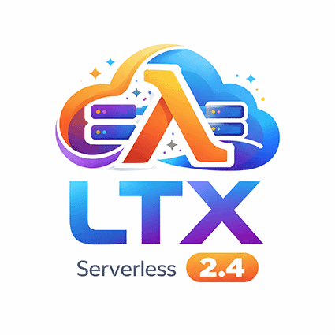

# LTX 2.3 22B Video Generation - RunPod Serverless

<p align="center">
  
</p>

RunPod serverless endpoint for video generation using the [LTX 2.3 22B](https://huggingface.co/Lightricks/LTX-2.3) model via ComfyUI. Supports text-to-video, image-to-video, audio-to-video ("infinite talk"), and optional synchronized audio generation.

## Features

- **Text-to-Video (t2v)**: Generate video from a text prompt alone
- **Image-to-Video (i2v)**: Animate a reference image guided by a text prompt
- **Audio-to-Video (a2v)**: Supply an audio file to generate video synchronized to the audio (similar to "infinite talk")
- **Audio Generation**: Optional synchronized audio via LTX 2.3 audio VAE
- **Two-Pass Pipeline**: Low-resolution generation followed by 2x latent upscaling for high-quality output
- **Distilled LoRA**: Fast inference with CFG=1 using the distilled LoRA adapter
- **Network Volume**: Models stored on RunPod network volume for fast builds and cold starts

## Architecture

The pipeline runs a two-pass generation process:

1. **Pass 1 (Low Resolution)**: Generates at the target resolution (default 960x544) using `euler_ancestral_cfg_pp` with 8 sigma steps
2. **Latent Upscale**: 2x spatial upscaling of the latent using `ltx-2.3-spatial-upscaler-x2`
3. **Pass 2 (High Resolution)**: Refines the upscaled latent using `euler_cfg_pp` with 3 sigma steps
4. **Decode**: Tiled VAE decode for video frames + optional audio VAE decode

## API Reference

### Endpoint

```
POST https://api.runpod.ai/v2/{ENDPOINT_ID}/run
```

### Request Body

```json
{
  "input": {
    "prompt": "A serene mountain landscape at sunrise",
    "width": 960,
    "height": 544,
    "num_frames": 121,
    "fps": 24,
    "seed": 42,
    "with_audio": true
  }
}
```

### Input Parameters

| Parameter | Type | Required | Default | Description |
|-----------|------|----------|---------|-------------|
| `prompt` | string | Yes | - | Text description of the desired video |
| `negative_prompt` | string | No | `"pc game, console game, video game, cartoon, childish, ugly"` | Text describing what to avoid |
| `image_base64` | string | No | - | Base64-encoded image for image-to-video mode (first frame) |
| `image_url` | string | No | - | URL of an image for image-to-video mode (first frame) |
| `image_path` | string | No | - | Server-local path to an image (advanced) |
| `audio_base64` | string | No | - | Base64-encoded audio for audio-to-video mode |
| `audio_url` | string | No | - | URL of an audio file for audio-to-video mode |
| `audio_path` | string | No | - | Server-local path to an audio file (advanced) |
| `last_frame_image_base64` | string | No | - | Base64-encoded image for last frame conditioning |
| `last_frame_image_url` | string | No | - | URL of an image for last frame conditioning |
| `last_frame_image_path` | string | No | - | Server-local path to last frame image (advanced) |
| `width` | int | No | `960` | Output width (rounded to nearest multiple of 32) |
| `height` | int | No | `544` | Output height (rounded to nearest multiple of 32) |
| `num_frames` | int | No | `121` | Number of frames to generate |
| `fps` | float | No | `24` | Frames per second |
| `seed` | int | No | random | Random seed for reproducibility |
| `with_audio` | bool | No | `true` | Generate synchronized audio (auto-enabled when audio input provided) |
| `distilled_lora_strength` | float | No | `0.5` | Strength of the distilled LoRA (0.0 - 1.0) |

### Response

```json
{
  "id": "job-abc123",
  "status": "COMPLETED",
  "output": {
    "video": "<base64-encoded MP4>"
  }
}
```

The `output.video` field contains the generated video as a base64-encoded MP4 file. Decode it and save to disk to get your video.

### Modes

**Text-to-Video**: Omit all image and audio parameters. The model generates a video purely from the text prompt.

**Image-to-Video**: Provide a first-frame image via `image_base64`, `image_url`, or `image_path`. The model animates the image guided by the text prompt.

**Audio-to-Video ("Infinite Talk")**: Provide an audio file via `audio_base64`, `audio_url`, or `audio_path`. Optionally combine with an image. The model generates video synchronized to the audio. Max resolution: 1600x900 (exceeding this produces black videos).

**With Generated Audio**: Set `with_audio: true` (default). The model generates synchronized audio alongside the video. The output MP4 includes both video and audio tracks.

**Without Audio**: Set `with_audio: false`. Only video is generated, resulting in faster inference and lower VRAM usage.

## Examples

### Text-to-Video with Audio

```bash
curl -X POST "https://api.runpod.ai/v2/${ENDPOINT_ID}/run" \
  -H "Authorization: Bearer ${RUNPOD_API_KEY}" \
  -H "Content-Type: application/json" \
  -d '{
    "input": {
      "prompt": "A traditional Japanese tea ceremony in a tatami room with soft koto music",
      "width": 960,
      "height": 544,
      "num_frames": 121,
      "fps": 24,
      "seed": 42,
      "with_audio": true
    }
  }'
```

### Image-to-Video without Audio

```bash
curl -X POST "https://api.runpod.ai/v2/${ENDPOINT_ID}/run" \
  -H "Authorization: Bearer ${RUNPOD_API_KEY}" \
  -H "Content-Type: application/json" \
  -d '{
    "input": {
      "prompt": "The scene comes alive with gentle movement and cinematic lighting",
      "image_url": "https://example.com/photo.jpg",
      "width": 960,
      "height": 544,
      "num_frames": 121,
      "seed": 42,
      "with_audio": false
    }
  }'
```

### Audio-to-Video (Infinite Talk)

```bash
curl -X POST "https://api.runpod.ai/v2/${ENDPOINT_ID}/run" \
  -H "Authorization: Bearer ${RUNPOD_API_KEY}" \
  -H "Content-Type: application/json" \
  -d '{
    "input": {
      "prompt": "A person speaking passionately to the camera",
      "image_url": "https://example.com/speaker.jpg",
      "audio_url": "https://example.com/speech.mp3",
      "width": 720,
      "height": 720,
      "num_frames": 121,
      "seed": 42
    }
  }'
```

### Python Client

```python
from generate_video_client import GenerateVideoClient

client = GenerateVideoClient(
    runpod_endpoint_id="your-endpoint-id",
    runpod_api_key="your-api-key"
)

# Text-to-video with generated audio
result = client.generate_video(
    prompt="A futuristic city at night with neon lights",
    width=960,
    height=544,
    num_frames=121,
    seed=42,
    with_audio=True,
)
if result.get('status') == 'COMPLETED':
    client.save_video_result(result, "./output.mp4")

# Audio-to-video (infinite talk)
result = client.generate_video(
    prompt="The person is singing passionately",
    image_path="./singer.jpg",
    audio_path="./song.mp3",
    width=720,
    height=720,
    num_frames=121,
)
if result.get('status') == 'COMPLETED':
    client.save_video_result(result, "./singing.mp4")
```

## Deployment

### Prerequisites

1. **RunPod Network Volume** (100 GB) with models pre-downloaded
2. GPU: 48 GB VRAM (A6000/A40 or L40/L40S/RTX 6000 Ada)
3. CUDA: 12.4+

### Network Volume Setup (One-Time)

Models (~79 GB) are stored on a RunPod network volume, not baked into the Docker image. This keeps the build fast (~6-10 minutes) and well under the 30-minute build limit.

1. **Create a 100 GB network volume** in RunPod console. Pick the same datacenter where your GPU workers will run.

2. **Spin up a temporary GPU pod** with the volume mounted (any cheap GPU is fine).

3. **Download models** by pasting this into the pod terminal:

```bash
mkdir -p /workspace/models/checkpoints /workspace/models/clip \
         /workspace/models/loras/ltxv/ltx2 /workspace/models/latent_upscale_models

wget -O /workspace/models/checkpoints/ltx-2.3-22b-dev.safetensors \
  "https://huggingface.co/Lightricks/LTX-2.3/resolve/main/ltx-2.3-22b-dev.safetensors"

wget -O /workspace/models/clip/comfy_gemma_3_12B_it.safetensors \
  "https://huggingface.co/Comfy-Org/ltx-2/resolve/main/split_files/text_encoders/gemma_3_12B_it.safetensors"

wget -O /workspace/models/loras/ltxv/ltx2/ltx-2.3-22b-distilled-lora-384.safetensors \
  "https://huggingface.co/Lightricks/LTX-2.3/resolve/main/ltx-2.3-22b-distilled-lora-384.safetensors"

wget -O /workspace/models/latent_upscale_models/ltx-2.3-spatial-upscaler-x2-1.0.safetensors \
  "https://huggingface.co/Lightricks/LTX-2.3/resolve/main/ltx-2.3-spatial-upscaler-x2-1.0.safetensors"
```

4. **Terminate the temporary pod**. The models persist on the volume.

5. **Attach the volume** to your serverless endpoint. On the serverless endpoint, the volume is mounted at `/runpod-volume/`.

### Build and Deploy

1. Build the Docker image:
   ```bash
   docker build -t ltx23-video-gen .
   ```

2. Push to a container registry accessible by RunPod:
   ```bash
   docker tag ltx23-video-gen your-registry/ltx23-video-gen:latest
   docker push your-registry/ltx23-video-gen:latest
   ```

3. Create a RunPod serverless endpoint using the pushed image.

4. Configure the endpoint with:
   - GPU Type: AMPERE_48 (A6000/A40, 48 GB) or ADA_48_PRO (L40/L40S/6000 Ada, 48 GB)
   - Container Disk: 30 GB
   - Network Volume: Attach the volume with pre-downloaded models

## Models

The following models are stored on the network volume (~79 GB total):

| Model | Size | Source |
|-------|------|--------|
| `ltx-2.3-22b-dev.safetensors` | 46.1 GB | [Lightricks/LTX-2.3](https://huggingface.co/Lightricks/LTX-2.3) |
| `comfy_gemma_3_12B_it.safetensors` (Gemma 3 12B text encoder) | 24.4 GB | [Comfy-Org/ltx-2](https://huggingface.co/Comfy-Org/ltx-2) |
| `ltx-2.3-22b-distilled-lora-384.safetensors` | 7.61 GB | [Lightricks/LTX-2.3](https://huggingface.co/Lightricks/LTX-2.3) |
| `ltx-2.3-spatial-upscaler-x2-1.0.safetensors` | 996 MB | [Lightricks/LTX-2.3](https://huggingface.co/Lightricks/LTX-2.3) |

## Notes

- Width and height are automatically rounded to the nearest multiple of 32
- The default resolution of 960x544 works well for most use cases
- For audio-to-video mode, max resolution is 1600x900 (exceeding this produces black videos)
- Higher `distilled_lora_strength` values (closer to 1.0) speed up inference but may reduce quality
- Audio generation adds processing time; disable with `with_audio: false` when not needed
- For image-to-video, the input image is automatically resized (longer dimension scaled to 1536px)
- When providing audio input, `with_audio` is automatically set to `true`
- Models are loaded from a network volume at `/runpod-volume/models/` -- ensure the volume is attached
